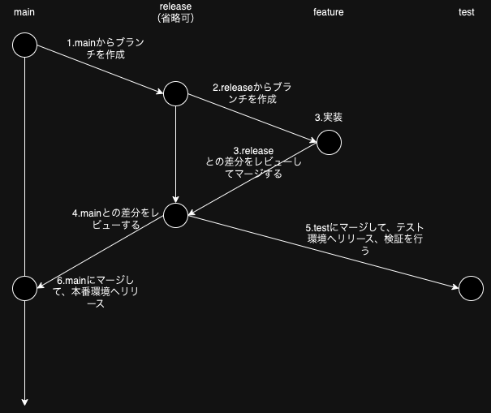

# kintone-vite-template

Viteを使用したKintoneカスタマイズ

## 準備

### 環境変数を設定する

1. .envrc を作成する

```
export KINTONE_BASE_URL=
export KINTONE_USER=
export KINTONE_PASSWORD=
```

2. 有効化する

```
$ direnv allow
```

## 開発

### 検証環境へのデプロイ

Actions で test ブランチへマージ時に自動デプロイするので基本的に手動で実行することはありません。

```
$ npm run deploy:test
```

### 本番環境へのデプロイ

Actions で リリース公開時に自動デプロイするので基本的に手動で実行することはありません。

```
$ npm run deploy:prod
```

# ディレクトリ構成

```
kintone-app/
├─.github # プルリクテンプレートや自動デプロイの設定
├─src/
│ ├─apps/ # kintone各アプリのカスタマイズを管理するディレクトリ
│ | ├─(app name)/ # 各アプリのカスタマイズ用ファイルを格納する
│ | | ├─features # 機能ごとにロジック等を管理するディレクトリ
│ | | ├─types # 各アプリで使用する型定義
│ | | ├─index.ts # エントリーポイントとなるファイル
│ ├─components # ボタンやフォームなど汎用的なコンポーネントを格納する
│ ├─constants # 汎用的な変数を格納
│ ├─global # kintone全体のカスタマイズを管理するディレクトリ
│ ├─utils # 汎用的な関数を格納
```

# ブランチの運用方法

GitFeatureFlow



詳細：[GitFlowは使わない！シンプルな「GitFeatureFlow」を紹介します](https://developers.gnavi.co.jp/entry/GitFeatureFlow/koyama)
